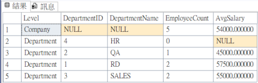

# 📘 SQL 學習筆記整理  
> 日期：2025-11-04
> 主題：SQL View

---

## 🧩 一、建立最基本的部門×員工 View

### 目的：把最常用的 JOIN 封裝成 view
```sql
CREATE VIEW dbo.vw_DepartmentEmployees
AS
SELECT
    d.ID        AS DepartmentID,
    d.Name      AS DepartmentName,
    e.ID        AS EmployeeID,
    e.Name      AS EmployeeName,
    e.Salary,
    e.DepartmentID
FROM dbo.Departments AS d
LEFT JOIN dbo.Employees   AS e
  ON d.ID = e.DepartmentID;
GO

立刻測試：

SELECT TOP (100) *
FROM dbo.vw_DepartmentEmployees
ORDER BY DepartmentName, EmployeeName;

View 內部不建議放 ORDER BY（除非配 TOP），排序丟給外部查詢。
```
--------
## 統計用 View：每部門人數與平均薪資

### 目的：把聚合邏輯做成可重用的報表來源
```sql
CREATE VIEW dbo.vw_DepartmentStats
AS
SELECT
    d.ID        AS DepartmentID,
    d.Name      AS DepartmentName,
    COUNT(e.ID)                            AS EmployeeCount,
    AVG(CAST(e.Salary AS DECIMAL(12,2)))   AS AvgSalary
FROM dbo.Departments d
LEFT JOIN dbo.Employees e
  ON d.ID = e.DepartmentID
GROUP BY d.ID, d.Name;
GO

立刻測試：

SELECT *
FROM dbo.vw_DepartmentStats
ORDER BY DepartmentName;
```
--------
## 加入商業規則欄位（Computed Columns in View）
### 目的：把常用欄位轉換、對齊格式放進 view 裡，外部查詢更乾淨。
### 使用到 CASE WHEN ... THEN ... END AS ...
```sql
在 vw_DepartmentEmployees 加上「薪資等級」與「部門是否有人」。

ALTER VIEW dbo.vw_DepartmentEmployees
AS
SELECT
    d.ID        AS DepartmentID,
    d.Name      AS DepartmentName,
    e.ID        AS EmployeeID,
    e.Name      AS EmployeeName,
    e.Salary,
    CASE
        WHEN e.Salary IS NULL THEN NULL
        WHEN e.Salary >= 60000 THEN 'High'
        WHEN e.Salary >= 50000 THEN 'Mid'
        ELSE 'Low'
    END         AS SalaryBand,
    CASE WHEN e.ID IS NULL THEN 0 ELSE 1 END AS HasEmployee
FROM dbo.Departments AS d
LEFT JOIN dbo.Employees   AS e
  ON d.ID = e.DepartmentID;
GO

測試：

SELECT DepartmentName, EmployeeName, Salary, SalaryBand, HasEmployee
FROM dbo.vw_DepartmentEmployees
ORDER BY DepartmentName, Salary DESC;
```
--------
## 常見報表 View（多層聚合）
### 目的：一次回傳「公司層級 + 部門層級」的資訊，適合後續 C# 報表。
```sql
CREATE VIEW dbo.vw_CompanyAndDeptSummary
AS
SELECT 
    'COMPANY'      AS Level,
    NULL           AS DepartmentID,
    NULL           AS DepartmentName,
    COUNT(e.ID)    AS EmployeeCount,
    AVG(CAST(e.Salary AS DECIMAL(12,2))) AS AvgSalary
FROM dbo.Employees e

UNION ALL

SELECT 
    'DEPARTMENT'   AS Level,
    d.ID           AS DepartmentID,
    d.Name         AS DepartmentName,
    COUNT(e.ID)    AS EmployeeCount,
    AVG(CAST(e.Salary AS DECIMAL(12,2))) AS AvgSalary
FROM dbo.Departments d
LEFT JOIN dbo.Employees e
  ON d.ID = e.DepartmentID
GROUP BY d.ID, d.Name;
GO

測試：
SELECT *
FROM dbo.vw_CompanyAndDeptSummary
ORDER BY Level, DepartmentName;
```

--------
## 查看 / 修改 / 刪除 View
```sql
-- 看定義
sp_helptext 'dbo.vw_DepartmentEmployees';

-- 修改（語法同 CREATE，換成 ALTER）
ALTER VIEW dbo.vw_DepartmentEmployees
AS
SELECT ...;

-- 刪除
DROP VIEW dbo.vw_DepartmentEmployees;
```
--------
## 權限（實務必備）
```sql
讓使用者只能查 view，不直接摸底層表：

-- 範例：把查詢權限給某個登入使用者或角色
GRANT SELECT ON dbo.vw_DepartmentEmployees TO [SomeUserOrRole];
```
--------
## 進階：SCHEMABINDING 與 View 索引
```sql

* WITH SCHEMABINDING：鎖住底層表結構（避免被偷偷改欄位破壞 view）。

* Indexed View（有實體化儲存、像物化檢視）：
需要嚴格條件，通常 OLTP 很少用，OLAP 報表場景會考慮。

CREATE VIEW dbo.vw_DepartmentStats_Bound
WITH SCHEMABINDING
AS
SELECT
    d.ID   AS DepartmentID,
    d.Name AS DepartmentName,
    COUNT_BIG(e.ID)                         AS EmployeeCount,  -- 注意 COUNT_BIG
    AVG(CAST(e.Salary AS DECIMAL(12,2)))    AS AvgSalary
FROM dbo.Departments d
LEFT JOIN dbo.Employees e
  ON d.ID = e.DepartmentID
GROUP BY d.ID, d.Name;
GO

-- COUNT_BIG 是建立索引 View 時的一個嚴格要求，它要求聚合函數必須使用可以確保結果不會溢位的類型，以保證數據的精確性。   

-- 建唯一叢集索引（Indexed View 的必要條件之一）
-- CREATE UNIQUE CLUSTERED INDEX IX_vw_DepartmentStats_Bound
-- ON dbo.vw_DepartmentStats_Bound(DepartmentID);
